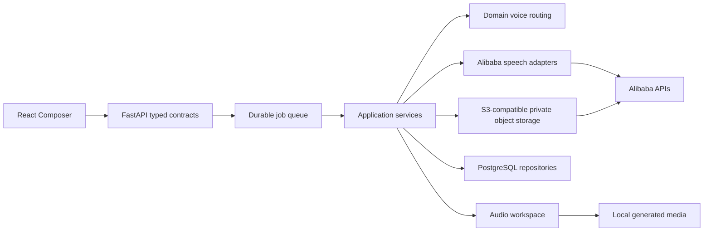
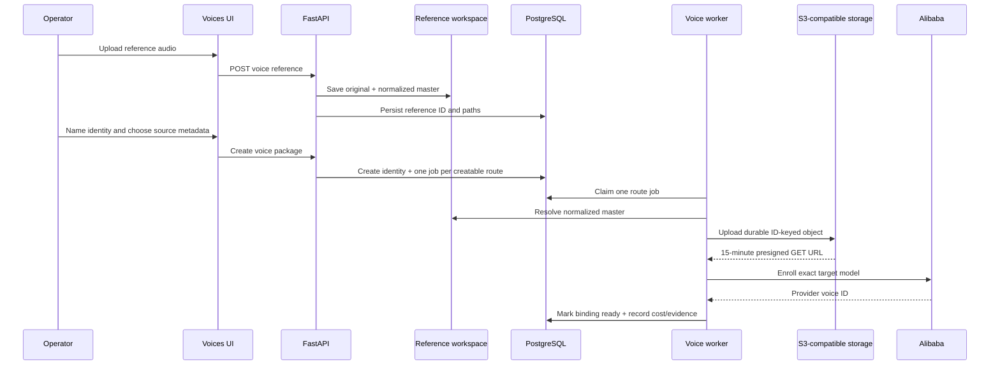
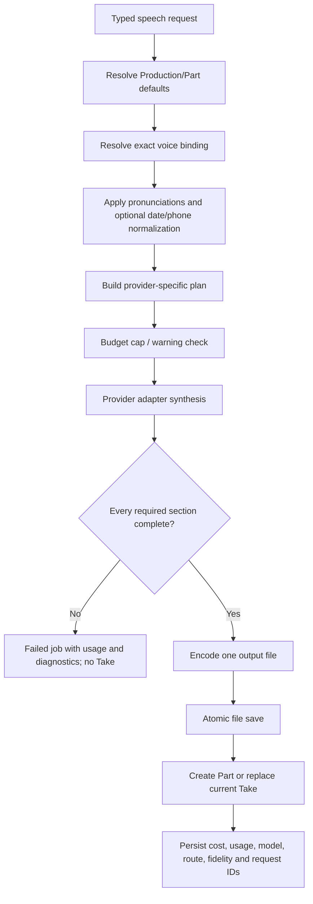

# Audio Studio — Composer and cloned-voice system

**Audience:** CTO, senior engineers, product/operations leads

**Status:** implementation audit note

**Audited:** 2026-08-11

**Scope:** voice reference upload, Alibaba enrollment, voice registry, Composer,
text preparation, speech generation, long-text handling, persistence, storage,
costs, failures, and every current speech entry point.

This document describes the code that is running today. It is not a product
proposal and it does not treat provider marketing claims as implementation
facts. Exact source owners are linked throughout so each statement can be
checked against the repository.

## 1. Executive summary

Audio Studio is **voice-identity first**:

1. A cloned voice represents one human identity.
2. That identity can own several provider bindings, one for each installed
   speech capability and quality tier.
3. The language of the clone recording is provenance used during Alibaba
   enrollment. It is not a synthesis restriction.
4. The flag/editorial language is a team casting label. It is not sent to
   Alibaba and never limits synthesis.
5. The language to speak belongs to each recording request in the Script step.
6. A ready cloned binding remains selectable in every output language. The UI
   displays Alibaba's published coverage as guidance but does not block the
   operator. Alibaba remains the final authority at generation time.
7. The exact selected binding is resolved before any paid call. Audio Studio
   never silently changes a cloned voice, engine, or tier.
8. Long text is accepted by the product. Provider-specific adapters own the
   necessary splitting and return one assembled recording.
9. Partial generation is atomic: if every required section is not completed,
   Audio Studio does not save an incomplete Take.

There are three installed Alibaba speech capabilities:

| Operator capability | Engine | Exact model(s) | Intended use |
|---|---|---|---|
| Expressive speech + tags | `audio` | `qwen-audio-3.0-tts-flash` for cloned voices; `qwen-audio-3.0-tts-plus` and `...-flash` for supported system routes | Tags, direction, speed, pitch and volume |
| Natural performance | `omni` | `qwen3.5-omni-plus`, `qwen3.5-omni-flash` | Directed multilingual narration with returned-text verification |
| Exact long reading | `qwen_tts` | `qwen3-tts-vc-2026-01-22` | Straightforward cloned-voice narration without tags or direction |

Current code-level catalogue/estimate rates (USD) are versioned as
`alibaba-model-pricing-2026-07-15`:

| Usage | International/Singapore | Beijing | Accounting note |
|---|---:|---:|---|
| Qwen Audio TTS Plus | $20 / 1M characters | $19.253 / 1M characters | Actual accepted generated characters |
| Qwen Audio TTS Flash | $15 / 1M characters | $13.7521 / 1M characters | Actual accepted generated characters |
| Qwen3 TTS VC | $11.50 / 1M characters | Catalogue currently shared in app | Actual accepted generated characters |
| Omni Plus | $1.40 input text, $11 input audio, $8.30 output text, $44 output audio / 1M tokens | App catalogue currently shared | Actual token classes when returned |
| Omni Flash | $0.40 input text, $3 input audio, $2.20 output text, $11.90 output audio / 1M tokens | App catalogue currently shared | Actual token classes when returned |
| Omni or Qwen3 TTS enrollment | $0.01 / binding | App catalogue currently shared | Catalogue creation cost |
| Qwen Audio enrollment | $0 | $0 | Recorded as not billed |

These are application catalogue values, not a promise that credits, free tiers,
taxes or a provider invoice will match. A CTO review should compare them with
the active Alibaba account price sheet before every pricing release.

The canonical capability facts, model IDs, language lists and price metadata
live in [`audio_studio/domain/provider_catalog.py`](../audio_studio/domain/provider_catalog.py).

## 2. Product invariants

These are deliberate rules, not accidental UI behavior.

### 2.1 Voice identity is independent from language

- `Eve`, `Mehdi`, or any future operator is a human voice identity.
- A source recording may be English, Arabic, Indonesian, or another language.
- `recording_language` answers only: **what language was spoken in the saved
  clone master?**
- `editorial_language` answers only: **how does the team usually cast or label
  this voice?** It drives the displayed flag/label.
- `language` on a generation request answers: **what language should this Take
  speak?**
- None of these values is allowed to rename or redefine the human identity.

### 2.2 Cloned voices are the primary product asset

Alibaba catalogue voices are supported, but cloned identities are the main
business object. The UI groups provider IDs under the human identity so an
operator chooses a person first, then a recording capability. Display names
can change without breaking generated history because requests and bindings
use stable identity/provider IDs.

### 2.3 Published language coverage is guidance

For a ready custom binding:

- the Composer does not filter it by output language;
- the backend does not reject it based on its source flag;
- choosing a language never changes the selected capability;
- unsupported/unlisted combinations show an amber warning and can still be
  attempted;
- a provider rejection is recorded as a failed job with evidence.

System voices keep their provider-documented restrictions. A known stock Audio
voice may be routed to the safe Omni system voice for an Arabic request, but a
custom identity is never silently replaced.

The selection rule is implemented in
[`audio_studio/domain/voice_routing.py`](../audio_studio/domain/voice_routing.py).
The equivalent frontend rule is in
[`frontend/src/lib/voice-options.ts`](../frontend/src/lib/voice-options.ts).

### 2.4 Exact route or explicit failure

A speech request specifies all of:

- human `voice_identity_id` for a cloned voice;
- provider `voice` ID;
- engine: `audio`, `omni`, or `qwen_tts`;
- tier: `plus`, `flash`, or `vc` as valid for that engine;
- output language;
- script state and delivery/output settings.

The backend resolves an exact ready binding. If it does not exist, the request
fails before enqueueing paid synthesis. It does not fall back to another
capability of the same person.

## 3. System ownership and boundaries



| Responsibility | Owner |
|---|---|
| Capability/model/language/pricing facts | `domain/provider_catalog.py` |
| Clone-package planning | `domain/voice_packages.py` |
| Exact voice-route resolution | `domain/voice_routing.py` |
| Composer presentation and request construction | `frontend/.../speech-tool.tsx` |
| Shared voice/capability UI | `frontend/src/components/voice-picker.tsx`, `voice-method-picker.tsx`, `voice-language-support.tsx` |
| HTTP validation and durable enqueue | `http/routers/jobs.py` |
| Speech use case and atomic persistence | `application/speech.py` |
| Provider-neutral Alibaba orchestration | `infrastructure/alibaba/speech_generation.py` |
| Qwen Audio TTS protocol | `infrastructure/alibaba/audio_tts.py` |
| Qwen 3.5 Omni protocol and fidelity recovery | `infrastructure/alibaba/omni.py` |
| Qwen3 TTS VC protocol | `infrastructure/alibaba/qwen_tts.py` |
| Clone enrollment protocol | `infrastructure/alibaba/voice_cloning.py` |
| Durable clone-master workspace | `infrastructure/upload_workspace.py`, `voice_reference_workspace.py` |
| Private object transfer to Alibaba | `infrastructure/object_storage.py` |
| Immutable generated-file writes | `infrastructure/audio_workspace.py` |

Provider integrations do not own UI state or database writes. Application
services do not parse provider streams. Domain routing does not use the
network, filesystem, or database.

## 4. Canonical voice data model

A voice is not one Alibaba string. It is an aggregate with stable IDs:

### 4.1 Voice identity

Represents the human/casting asset.

Important fields:

- stable public identity ID;
- editable display name;
- status, e.g. active or archived;
- editorial metadata such as casting language, gender, trait, photo;
- preserved reference recordings;
- zero or more provider bindings;
- usage summary across Productions and Activity.

Provider IDs and display names are therefore not primary identity keys.

### 4.2 Voice reference

Represents the clone master supplied by the operator.

The upload workspace stores, under an ID-owned directory:

```text
.media/voice-references/{reference_id}/original.{source-extension}
.media/voice-references/{reference_id}/normalized-24k.wav
```

When FFmpeg is available the normalized master is 24 kHz, mono, signed 16-bit
PCM WAV. Duration and basic audio metadata are persisted. The original is also
preserved. Legacy flat `.uploads` references are copied—not moved—into the new
ID-owned location before database paths are updated.

### 4.3 Provider binding

Represents one enrollment of the identity for one exact provider model:

- provider: Alibaba;
- engine and tier;
- exact `model_id`;
- Alibaba `provider_voice_id`;
- status (`queued`, `running`, `ready`, `failed`, etc.);
- provider region and endpoint;
- creation cost and price version;
- published output-language metadata.

One identity can therefore have up to four current ready bindings:

1. Qwen Audio TTS Flash;
2. Qwen 3.5 Omni Plus;
3. Qwen 3.5 Omni Flash;
4. Qwen3 TTS Voice Clone.

Bindings are independent jobs. Partial package success is valid: one model may
be ready while another failed, and only the failed binding is retried.

### 4.4 Generated Take and job

Each generation records the resolved engine, tier, exact model, provider voice
ID, human identity ID, output language, script states, delivery settings,
provider request IDs, usage, costs, diagnostics, fidelity result and stored
filename. The durable job independently records its lifecycle and is the
source for Activity and Speak attempt history.

## 5. Cloning: complete lifecycle



### 5.1 Upload and preservation

The reference must be decodable audio. The stored original and normalized
master are product data, not disposable upload scratch. A clone can later add
or retry a provider binding using the same preserved master.

### 5.2 Source language and casting metadata

At creation time:

- `language`/`recording_language` describes the reference recording;
- `editorial_language` is optional casting metadata for the team;
- name, gender, trait and image are identity metadata.

The source language is used to decide which provider enrollment routes Alibaba
documents for that reference. It does **not** decide future output languages.

### 5.3 Package planning

[`audio_studio/domain/voice_packages.py`](../audio_studio/domain/voice_packages.py)
enumerates all installed routes, then marks whether the source recording
language is documented for enrollment by that exact model.

Current source-language enrollment matrices:

- Qwen Audio TTS clone: 13 languages;
- Qwen 3.5 Omni clone: 29 languages;
- Qwen3 TTS VC clone: 10 languages.

For an English source, “All available capabilities” currently creates all four
bindings. For an Arabic source, the current catalogue documents Omni Plus and
Omni Flash enrollment, so those are the routes automatically created. This is
an **enrollment constraint**, not a rule that an English clone cannot later
attempt Arabic or that an Arabic clone must speak Arabic.

If Alibaba changes these matrices, only the central catalogue should change.
There must not be separate lists in Composer screens.

### 5.4 Private object storage handoff

Alibaba must be able to fetch the reference. Audio Studio uploads the normalized
master to configured S3-compatible object storage using a key based on durable
application IDs, never a person name:

```text
{prefix}/v1/organizations/{organization_id}/objects/
voice-references/{reference_id}/source.wav
```

The object includes SHA-256 checksum metadata and `retention=durable` metadata
and tag. A presigned GET URL is valid for 900 seconds. URLs are cached in the
worker for at most 600 seconds. The bucket remains private.

The current environment variable names use the historical `RUSTFS_*` prefix,
but the adapter uses the S3 protocol and is compatible with a future managed
S3 service. Credentials, endpoint, bucket, region and prefix are configuration,
not business logic.

### 5.5 Exact enrollment calls

#### Qwen Audio TTS cloned binding

Uses DashScope `VoiceEnrollmentService.create_voice`:

- `target_model`: `qwen-audio-3.0-tts-flash`;
- sanitized alphanumeric prefix, maximum 10 characters;
- presigned reference URL;
- `language_hints` only when the source language is documented for this
  enrollment model;
- `max_prompt_audio_length`: 30 seconds.

#### Qwen 3.5 Omni cloned bindings

Uses the `qwen-voice-enrollment` action API:

- action `create`;
- target model `qwen3.5-omni-plus` or `qwen3.5-omni-flash`;
- sanitized alphanumeric/underscore preferred name, maximum 16 characters;
- presigned reference URL;
- source language when present.

#### Qwen3 TTS Voice Clone binding

Uses the same `qwen-voice-enrollment` action API:

- target model `qwen3-tts-vc-2026-01-22`;
- preferred name and presigned reference URL;
- source language when present;
- reference transcript when the application has one.

### 5.6 Failure and retry behavior

- Missing Alibaba credentials or object storage stops enrollment before a
  provider call.
- Each binding has its own job and status.
- A provider failure does not delete the identity or its reference master.
- The UI exposes the failed route and can retry only that route.
- A binding becomes selectable only after a positive ready/active state.

## 6. Composer: one shared implementation

The main Composer is
[`frontend/src/components/production-tools/speech-tool.tsx`](../frontend/src/components/production-tools/speech-tool.tsx).
It is reused by:

- **Speak** for standalone recording sessions;
- **Production / Add Part**;
- **Production / Insert Part**;
- **Production / Record Draft**;
- **Production / New Take**.

Batch uses the same voice registry and capability concepts but has a batch-
specific input flow. Voice presentation and model facts come from shared
components/utilities rather than being copied per screen.

### 6.1 Step 1 — Voice

The operator chooses:

1. the human voice identity;
2. a ready recording capability;
3. the quality tier when the capability has more than one.

The voice control displays the photo/avatar, full human name and editorial
flag. The flag is explicitly described as a casting tag. It does not prefill
or constrain the output language.

Capability rows show both operator wording and the real model product. Expanded
details show exact model IDs. The three operator choices are:

- **Expressive speech + tags** — Qwen Audio TTS;
- **Exact long reading** — Qwen3 TTS Voice Clone;
- **Natural performance** — Qwen 3.5 Omni.

Only ready bindings owned by the selected identity are enabled. Output language
is not part of this filtering.

### 6.2 Step 2 — Script

The output language lives beside the script because it belongs to this Take,
not to the voice profile. Its default is `Auto`. Changing it never changes the
voice, engine or tier.

The language panel reports one of:

- officially supported by the exact binding;
- not documented, but generation remains allowed;
- Auto, meaning language detection/delegation is left to the selected model.

The editor uses `dir="auto"`, so Arabic and other RTL scripts render correctly
without making language a casting restriction.

### 6.3 Script states

The Composer can retain three explicit versions:

- **Raw** — the operator's source text;
- **Spoken** — an optional rewrite for listening;
- **Tagged** — the same words with supported Qwen Audio delivery tags.

The selected `text_state` determines which version is sent for synthesis. All
states are persisted on a Production Part so operators can review and switch
without losing authored text.

### 6.4 Step 3 — Delivery

Delivery controls depend on the selected capability:

- **Qwen Audio TTS:** inline delivery tags, a natural-language direction,
  presets, and numeric voice controls;
- **Qwen 3.5 Omni:** Exact or Directed mode. Directed mode sends one overall
  natural-language performance direction. Inline tags are rejected;
- **Qwen3 TTS VC:** no inline tags and no performance instruction.

If a Tagged script is selected and the operator switches to Omni or Qwen3 TTS,
the Composer blocks Generate and asks the operator to use Raw/Spoken or remove
known delivery tags. The backend repeats this validation, so bypassing the UI
cannot send an invalid tagged request.

### 6.5 Step 4 — Output

Common output formats are MP3, MP3 24 kHz, WAV and Opus. Internally Opus is
stored with an OGG extension.

Only Qwen Audio exposes numeric controls:

- speed `0.5`–`2.0`;
- pitch `0.5`–`2.0`;
- volume `0`–`100`;
- seed is retained in the request/history.

Omni delivery is controlled by natural-language direction. Qwen3 TTS VC uses
the cloned voice and prepared script without numeric tuning in this interface.

### 6.6 Generate, another Take, Draft and session behavior

- **Speak:** each Generate produces a durable attempt in a URL-addressable
  recording session. “Another take · same setup” resubmits the exact stored
  voice, model, language, text and settings. Previous attempts remain visible
  with model, cost, status and audio.
- **New Production Part:** a pending card appears immediately while the durable
  job runs; success creates a Part at the requested sequence position.
- **Draft:** saves script and settings without a provider call. Record Draft
  later renders it.
- **New Take:** preserves the Part identity and previous Take history while
  replacing the current selected audio/settings atomically.

## 7. Optional text preparation

Text preparation is a separate paid Alibaba text service. It is never silently
run during speech generation.

Model: **`qwen3.7-plus`**, reasoning disabled.

The UI shows an estimate before the call and the actual returned-token cost
afterward when Alibaba supplies usage. The prompt templates are centrally owned
and editable in Settings.

### 7.1 “Make it spoken” prompt

System prompt:

```text
You rewrite text so it sounds right when spoken aloud. Keep the meaning, the language and the facts exactly. Change only how it is built for a listener:
- shorter sentences; break long ones
- punctuation that gives the reader room to breathe, including ellipses where a pause helps
- no headings, no bullet symbols, no markdown, no parentheses read aloud as clutter
- spell out anything a reader would stumble over
- do not add new information, do not summarise, do not add tags
Reply with the rewritten text only, nothing else.
```

If a Production has an editorial voice style, this line is appended:

```text
The voice of this work, in the owner's words: {style}
```

The user message contains only the current script. The result is presented as
a word-level diff. The operator must Accept or Reject it. Unlike tagging, this
operation is allowed to reshape sentences, so review is mandatory.

### 7.2 “Add delivery tags” prompt

This action is available only for Qwen Audio TTS.

```text
You add inline delivery tags to text that is about to be spoken by a text-to-speech model.
MOOD tags set a delivery that holds until the next mood tag: {moods}
SOUND tags make one effect then return to normal: {sounds}
Never use any other tag, including {retired}.
Rules: use ONLY tags from those two lists, exactly as written. Never invent a tag. Never change, add or remove any of the words. Place a tag immediately before the words it applies to.
{density}
Reply with the tagged text only, nothing else.
```

Density is none, light, normal or heavy. The application strips unknown tags
and then compares the complete normalized word sequence after removing known
tags. If Alibaba changed, added or removed any word, Audio Studio rejects the
tagged result. Tags are metadata; the authored words are immutable.

Supported mood tags currently include `sad`, `amazed`, `angry`, `excited`,
`curious`, `tired`, `singing`, `asmr`, `empathetic`, `whispers`, `crying`,
`serious` and the other centrally catalogued Qwen Audio tags. Sound tags include
`gasp`, `sighing`, `clears throat`, `giggles`, `laughing`, `cough`, and `snorts`.
The full list lives in
[`audio_studio/domain/delivery_tags.py`](../audio_studio/domain/delivery_tags.py).

## 8. HTTP contract and durable job boundary

Speech generation enters through `POST /api/v1/jobs/speech`.

The Pydantic contract:

- forbids unknown fields;
- allows scripts up to 500,000 characters;
- validates valid engine/tier combinations;
- validates output formats and numeric ranges;
- distinguishes `create`, `regenerate`, and `render_draft`;
- requires Production and Part IDs for replacement operations;
- prevents a Speak session from being attached to a Production;
- performs exact voice-route preflight before job enqueue.

Every request receives an idempotency key. The job is durable and reports
queued/running/retrying/success/failure lifecycle, progress, timestamps, result
and error. Provider calls happen in the worker, not in the HTTP request.

## 9. Common backend generation flow



### 9.1 Defaults and inheritance

- A new Production Part inherits Production speech settings, then applies the
  explicit Composer request.
- A new Take or Draft render inherits the current Part settings, then applies
  explicit changes.
- Standalone Speak uses explicit request values and canonical defaults.

### 9.2 Text immediately before synthesis

The selected Raw/Spoken/Tagged text is the request `text`. Before provider
planning, the backend may:

1. apply centrally configured pronunciation replacements;
2. normalize ambiguous dates/phone numbers when that setting is enabled.

Applied pronunciations and rewrites are returned and persisted for audit.
Provider adapters never receive hidden system-level Composer metadata.

## 10. Qwen Audio TTS execution

### 10.1 Purpose and controls

Qwen Audio TTS is the expressive engine. It supports known inline mood/sound
tags, natural-language instruction, speed, pitch, volume and seed.

Cloned voices use `qwen-audio-3.0-tts-flash`. Plus exists in the catalogue for
compatible system routes but is not currently an enrollment tier for custom
clones.

### 10.2 Language behavior

When the explicit output language is in the 13-language Audio clone catalogue,
the adapter sends the documented language code as `language_hints`. For an
unlisted/experimental language it omits the hint and allows provider detection.
It does not locally reject the cloned voice.

### 10.3 Long-text plan

This is provider-native continuous synthesis, not one independent audio file
per sentence.

- maximum text submission planned by the app: 20,000 characters;
- maximum continuous session planned by the app: 200,000 characters;
- bounded submissions are grouped into ordered sessions;
- active mood state is carried to the next bounded submission so a technical
  boundary does not silently reset performance;
- each session uses one `SpeechSynthesizer`, multiple `streaming_call` calls,
  then one `streaming_complete`;
- returned PCM is 48 kHz, mono, 16-bit and all successful sessions are joined
  before final encoding.

A normal script remains one provider session. The operator is never asked to
manually shorten a long script.

### 10.4 Retry and acceptance

Each failed session can retry up to three times with exponential backoff unless
the error is classified as fatal (credentials, permission, invalid model/voice,
arrearage, etc.). No audio or provider transcript fidelity check is available
from this adapter. A zero-byte response or any failed required session causes
the whole job to fail without saving a Take.

### 10.5 Cost

Cost is computed from accepted generated characters using the regional
catalogue price. Diagnostics store submitted/generated characters and Alibaba
request IDs.

## 11. Qwen3 TTS Voice Clone execution

### 11.1 Purpose and payload

Model: `qwen3-tts-vc-2026-01-22`.

Each provider request is:

```json
{
  "model": "qwen3-tts-vc-2026-01-22",
  "input": {
    "text": "<one planned segment>",
    "voice": "<resolved cloned provider voice id>",
    "language_type": "<documented language label or Auto>"
  }
}
```

Endpoint path:
`/services/aigc/multimodal-generation/generation` on the configured regional
Alibaba HTTP base.

This capability accepts neither inline delivery tags nor performance
instructions.

### 11.2 Language behavior

The adapter sends an explicit `language_type` only for the 10 languages in the
current Qwen3 TTS VC catalogue. Otherwise it sends `Auto`. The Composer warns
about an unlisted language but does not block the attempt.

### 11.3 Long-text plan

Alibaba's provider boundary is 512 tokens. Audio Studio plans conservatively at
480 estimated Qwen tokens:

- split at semantic boundaries into ordered segments;
- send one HTTP request per segment;
- download the returned audio URL;
- decode each result to 24 kHz PCM;
- concatenate every accepted segment;
- encode one final output file.

If Alibaba still reports an input-length error, only that segment is split in
half recursively, up to three recovery levels. Other errors are retried up to
three times unless fatal.

Any unrecovered segment causes the whole job to fail and no incomplete Take is
saved.

### 11.4 Cost

Cost is catalogued by accepted generated characters. Usage, diagnostics,
request IDs, segment size and estimated tokens are persisted.

## 12. Qwen 3.5 Omni execution

### 12.1 Purpose

Models:

- `qwen3.5-omni-plus` — best-quality tier;
- `qwen3.5-omni-flash` — faster/economical tier.

Omni is a conversational Thinker/Talker, not a literal TTS endpoint. It is used
through the OpenAI-compatible streaming chat endpoint with text and audio
modalities. It does not accept Audio TTS inline tags.

### 12.2 Exact request steering

For each planned passage Audio Studio sends one user message, no system message
and no XML/Composer wrapper:

```text
Read aloud exactly the passage between BEGIN PASSAGE and END PASSAGE. [optional performance direction] Do not skip, summarize, translate, repeat, answer, explain, introduce, or add any words. Output only the passage.

BEGIN PASSAGE
<operator passage>
END PASSAGE
```

Payload essentials:

```json
{
  "model": "qwen3.5-omni-plus or qwen3.5-omni-flash",
  "messages": [{"role": "user", "content": "<prompt above>"}],
  "modalities": ["text", "audio"],
  "audio": {"voice": "<resolved voice id>", "format": "wav"},
  "stream": true,
  "stream_options": {"include_usage": true},
  "presence_penalty": 0.0
}
```

`presence_penalty` is explicitly zero because the provider default can suppress
intentional repetition in authored scripts.

Exact mode sends no direction. Directed mode appends the one operator-written
performance direction to every passage so the provider sees the same global
intent.

### 12.3 Streaming audio extraction

The official OpenAI client owns SSE framing. The adapter accepts documented
OpenAI-compatible and DashScope envelope shapes. Alibaba streams fragments of
one Base64 audio value; Audio Studio joins every fragment first and decodes only
after the complete passage stream. Decoding fragments independently previously
risked silently lost audio bytes and is prohibited.

Returned text deltas or the audio transcript are collected for fidelity
verification. Token classes and request IDs are collected from the stream.

### 12.4 Initial passage plan

The initial units are the operator's authored paragraphs. Audio Studio imposes
no invented fixed character ceiling. This preserves editorial structure and
limits recovery to the passage that Alibaba actually omitted or changed.

### 12.5 Fidelity and bounded recovery

For every passage, normalized requested and returned words are compared. A
passage is accepted only with both:

- coverage `1.0`;
- precision `1.0`.

If a passage is incomplete:

1. if it is longer than 72 characters and recovery depth is below six, it is
   split near semantic boundaries into smaller passages;
2. every child is requested and verified independently;
3. if the passage is already short, Audio Studio performs one identical second
   attempt for non-deterministic omission;
4. if any child or retry remains incomplete, the entire generation fails.

Transport/authentication/provider errors are not treated as length evidence.
They do not trigger a cascade of additional paid split requests.

This recovery is not an operator limitation or a prompt hack. It is an adapter-
level atomicity mechanism for a conversational model that may return incomplete
speech while billing audio tokens.

### 12.6 Audio assembly and silence guard

Accepted Omni passage audio is 24 kHz mono 16-bit PCM. Audio Studio removes only
pathological provider padding: more than three seconds of trailing near-silence
is shortened to 350 ms. Normal pauses are preserved. The amount removed is
stored in diagnostics. All accepted passages are concatenated and encoded once.

Because passages are separate provider turns, tone or volume can vary slightly
at joins. That is a known model tradeoff; the application does not pretend it
can guarantee cross-request performance continuity.

### 12.7 Cost and failure evidence

Omni cost uses Alibaba's returned input/output text/audio token classes and the
selected tier's token prices. If actual usage is unavailable, only then is the
pre-call character estimate used.

Incomplete jobs retain billed usage, provider request IDs and per-passage
diagnostics in the failed job. They do not create a playable Take.

## 13. File persistence and media identity

After complete synthesis, provider audio is encoded to the requested format and
passed to `AudioWorkspace`:

1. validate a supported extension;
2. generate an opaque UUID filename;
3. write a temporary file inside the configured media root;
4. atomically rename it to the final filename;
5. probe duration with FFprobe when available;
6. only then persist the Part/Take database row.

Generated media currently lives in the centralized local media root. The
S3-compatible store currently owns provider-accessible clone masters and other
temporary provider inputs, not all generated Takes. A future online deployment
should add a generated-media storage adapter behind the existing workspace
boundary rather than put S3 calls in application services.

Deleting a Part/output does not erase the historical job/accounting record.
Spend is an operational fact, not derived only from surviving files.

## 14. Cost, usage and guardrails

### 14.1 Pre-call estimate

Every generation is estimated before provider work. Preferences support:

- a daily spending cap;
- a “warn above” threshold requiring explicit confirmation.

The warning is not approval for a different voice/model; the confirmed request
retains the exact same setup.

### 14.2 Post-call accounting

| Capability | Preferred cost basis |
|---|---|
| Qwen Audio TTS | accepted generated characters × regional catalogue rate |
| Qwen3 TTS VC | accepted generated characters × catalogue rate |
| Qwen 3.5 Omni | actual returned input/output text/audio tokens |
| Spoken/Tagged text pass | actual returned input/output text tokens |
| Clone enrollment | catalogue creation charge per binding |

Estimates, actual cost basis, price version, provider region/endpoint, usage and
request IDs are retained so Activity can explain what was charged.

## 15. Entry-point behavior matrix

| Entry point | Uses shared identity registry | Uses shared speech backend | Persists job | Output destination |
|---|---:|---:|---:|---|
| Speak | Yes | Yes | Yes | Standalone recording session + Activity |
| Production Add/Insert Part | Yes | Yes | Yes | New ordered Production Part |
| Production New Take | Yes | Yes | Yes | Replaces current Take, retains history |
| Production Record Draft | Yes | Yes | Yes | Converts Draft to recorded Part |
| Batch | Yes | Yes | Yes | Batch outputs and Activity |

No entry point has permission to invent a separate provider/model routing rule.

## 16. Validation and failure semantics

### Before a paid request

- API key must be configured;
- selected human identity must exist when supplied;
- exact selected binding must be ready;
- engine/tier pair must be valid;
- script must be non-empty;
- tagged text must be compatible with the engine;
- Production/Part/session relationships must be valid;
- cap/warning rules must pass.

### During provider execution

- retryable failures receive bounded retries;
- fatal provider errors stop immediately;
- long-input recovery is engine-specific;
- provider request IDs and diagnostics are collected;
- Omni verifies every returned word;
- partial work never becomes a Take.

### After provider execution

- non-empty audio is required;
- output encoding and atomic save must succeed;
- database mutation must target the current Production/Part version;
- the response contains exact route, model, cost basis and provider evidence;
- warnings are human-readable while technical diagnostics remain in Activity.

## 17. Current published language matrices

These are centralized provider facts used for enrollment planning and UI
guidance. They are not casting restrictions for a ready cloned identity.

### Qwen Audio TTS clone — 13

Chinese, English, Japanese, Korean, German, French, Italian, Russian,
Portuguese, Thai, Indonesian, Malay, Vietnamese.

### Qwen 3.5 Omni clone — 29

Chinese, English, German, Italian, Portuguese, Spanish, Japanese, Korean,
French, Russian, Thai, Indonesian, Arabic, Czech, Danish, Dutch, Finnish,
Hebrew, Hindi, Icelandic, Malay, Norwegian, Persian, Polish, Swedish, Tagalog,
Turkish, Urdu, Vietnamese.

### Qwen3 TTS Voice Clone — 10

Chinese, English, German, Italian, Portuguese, Spanish, Japanese, Korean,
French, Russian.

The provider may accept useful combinations outside a published list or may
reject a listed combination because of account/region/model changes. The UI
states “documented” rather than promising universal success.

## 18. Test and regression obligations

Any change to cloning, Composer, language behavior, models or synthesis must
test the complete chain—not only click the UI.

Required automated coverage should include:

1. source/casting/output languages stay independent;
2. changing output language does not change identity, engine, tier or provider
   voice ID;
3. every ready custom route remains selectable for documented and undocumented
   output languages;
4. exact engine/tier binding resolution and explicit missing-route failure;
5. system-voice restrictions remain separate from custom-voice rules;
6. engine/tier HTTP contract validation;
7. Raw/Spoken/Tagged state persistence and tag word fidelity;
8. tags rejected for Omni/Qwen3 TTS in both UI and backend;
9. Qwen Audio 20k submission and 200k session planning;
10. Qwen3 TTS 480-token planning and bounded provider-limit recovery;
11. Omni Base64 fragment joining, exact word verification, semantic recovery,
    error non-splitting and atomic failure;
12. clone-reference durability and ID-contained paths;
13. per-binding clone success/failure/retry;
14. Speak “another take” repeats exact setup;
15. Production create/regenerate/draft operations;
16. cost basis and failed-job billing evidence;
17. atomic media save and no incomplete Take.

UI smoke tests then confirm presentation, RTL behavior, full names/photos/flags,
warnings, pending states, playable Takes and exact model labels. UI testing does
not replace the service/contract tests above.

## 19. Known limitations and deliberate non-features

1. **No CosyVoice adapter is installed.** The current production engines are
   the three Alibaba families listed in this document. Adding another provider
   must create a new adapter/catalog route, not masquerade as an existing model.
2. **Language coverage is metadata, not a guarantee.** Unlisted cloned-voice
   attempts are allowed and may fail or sound unreliable.
3. **Omni passage joins can vary in performance.** Fidelity is strict for words,
   not timbre continuity.
4. **Qwen Audio lacks returned transcript verification.** Atomic transport
   success and plausibility warnings are available, but not word-by-word proof.
5. **Qwen3 TTS output outside its documented matrix uses `Auto`.** The provider
   has the final decision.
6. **Generated media is local today.** Clone masters are durable locally and in
   S3-compatible storage for provider access. Generated-media cloud storage is
   a future adapter concern.
7. **Authentication/tenancy belongs to the future host shell.** The current app
   remains a local-first deployment and must not be exposed publicly without
   that integration.

## 20. CTO audit questions

The following questions should be answered before a multi-user/cloud rollout:

- Are Alibaba language/model facts synchronized from an authoritative release
  process with a reviewed effective date?
- Should enrollment allow an explicit operator override for undocumented
  source languages, with provider failure recorded normally?
- Should generated media move behind the same object-storage abstraction, with
  per-object storage identity rather than one mutable output root?
- Are private object lifecycle policies demonstrably preserving every durable
  clone master and expiring only temporary transcription inputs?
- Is the job worker separately supervised and observable in deployment?
- Are spending caps reserved atomically before paid work when multiple workers
  are introduced?
- Does the future host shell supply actor, organization, authorization and rate
  limits to every paid/mutating endpoint?
- Are restore procedures tested for the coupled PostgreSQL, generated-media and
  voice-reference data set?
- Are generated API types the single frontend contract rather than parallel
  handwritten request/response definitions?

## 21. Source map for reviewers

Start with these files in order:

1. [`audio_studio/domain/provider_catalog.py`](../audio_studio/domain/provider_catalog.py)
2. [`audio_studio/domain/voice_packages.py`](../audio_studio/domain/voice_packages.py)
3. [`audio_studio/domain/voice_routing.py`](../audio_studio/domain/voice_routing.py)
4. [`frontend/src/components/production-tools/speech-tool.tsx`](../frontend/src/components/production-tools/speech-tool.tsx)
5. [`audio_studio/http/routers/jobs.py`](../audio_studio/http/routers/jobs.py)
6. [`audio_studio/application/speech.py`](../audio_studio/application/speech.py)
7. [`audio_studio/infrastructure/alibaba/speech_generation.py`](../audio_studio/infrastructure/alibaba/speech_generation.py)
8. [`audio_studio/infrastructure/alibaba/audio_tts.py`](../audio_studio/infrastructure/alibaba/audio_tts.py)
9. [`audio_studio/infrastructure/alibaba/qwen_tts.py`](../audio_studio/infrastructure/alibaba/qwen_tts.py)
10. [`audio_studio/infrastructure/alibaba/omni.py`](../audio_studio/infrastructure/alibaba/omni.py)
11. [`audio_studio/application/text_preparation.py`](../audio_studio/application/text_preparation.py)
12. [`audio_studio/infrastructure/alibaba/voice_cloning.py`](../audio_studio/infrastructure/alibaba/voice_cloning.py)
13. [`audio_studio/infrastructure/upload_workspace.py`](../audio_studio/infrastructure/upload_workspace.py)
14. [`audio_studio/infrastructure/object_storage.py`](../audio_studio/infrastructure/object_storage.py)

This document should be updated in the same commit whenever a model ID,
capability behavior, enrollment rule, segmentation strategy, prompt, storage
contract or Composer routing invariant changes.
